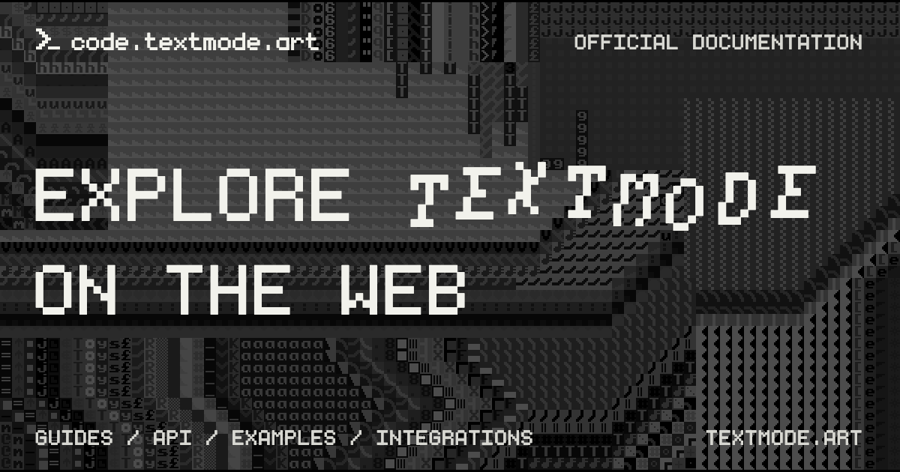

# code.textmode.art

|  |   |   |
| :--- | :--- | :--- |

`code.textmode.art` is the central documentation home for [textmode.js](https://github.com/humanbydefinition/textmode.js), with core concepts, API references, practical guides, examples, and integrations for creative coding on the web.

Whether you are installing `textmode.js` for the first time or extending a sketch with ecosystem add-ons, these docs help you learn the essentials, make your first browser sketch, and explore what the wider ecosystem has to offer.

## What's inside

- **Documentation** - Installation guides, API reference, and tutorials
- **Examples** - Interactive demos and code samples
- **Font showcase** - Curated collection of compatible pixel fonts
- **Integrations** - Guides for p5.js, Three.js, Hydra Synth, and more

## Contributing

Thank you for considering contributing to this project! (✿◠‿◠)

Please read the [Contributing Guide](./CONTRIBUTING.md) to get started.

<!-- TEXTMODE-CONTRIBUTORS:START -->
<!-- prettier-ignore-start -->
<!-- Generated from https://github.com/humanbydefinition/code.textmode.art/blob/main/.vitepress/data/contributors.json and https://github.com/humanbydefinition/code.textmode.art/blob/main/.vitepress/data/contribution-types.json. Do not edit this section directly. -->
## Contributors

Thanks to the people who contribute code, documentation, design, examples, ideas, infrastructure, and care
across the textmode.js ecosystem.

<!-- markdownlint-disable MD033 -->
<table>
  <tbody>
    <tr>
      <td align="center" valign="top" width="14.28%">
        <a href="https://github.com/humanbydefinition">
          
           <b>humanbydefinition</b>
        </a>
         💻 📖 🎨 💡 🤔 🚧 🚇 🔧 🔌 👀
      </td>
      <td align="center" valign="top" width="14.28%">
        <a href="https://github.com/trintlermint">
          
           <b>trintlermint</b>
        </a>
         🎨 💡
      </td>
    </tr>
  </tbody>
</table>
<!-- markdownlint-enable MD033 -->

Contribution details and profile links are maintained on the [textmode.js contributors page](https://code.textmode.art/docs/contributors).
<!-- prettier-ignore-end -->
<!-- TEXTMODE-CONTRIBUTORS:END -->

## License

Documentation content is licensed under [CC BY 4.0](https://creativecommons.org/licenses/by/4.0/). Code examples are licensed under [MIT](https://opensource.org/licenses/MIT).
