## How it works *(high‑level)*

The renderer operates in two passes:

1) Draw pass *(offscreen)*: your drawing commands emit instances that are flushed into a special framebuffer with three color attachments *(MRT)*. Each attachment encodes a different piece of per‑cell information.
2) Conversion pass *(onscreen)*: a conversion shader reads those attachments plus the font atlas to draw the final glyphs aligned to the grid.

### Render pipeline at a glance

```mermaid
%%{init: {"flowchart": {"nodeSpacing": 10, "rankSpacing": 30}}}%%
flowchart TD
	A["🎨 draw() commands"] --> B["📋 Draw queue"]
	B --> C["📦 Instance batching"]
	C --> D["⚡ Instanced shader"]
	D --> E["🎯 MRT framebuffer"]
	
	subgraph MRT["📊 3 attachments"]
		direction TB
		E0["o_character"] 
		E1["o_primaryColor"] 
		E2["o_secondaryColor"]
	end
	
	E --> MRT
	MRT --> F["🔄 Conversion shader"]
	F --> G["🖼️ Canvas"]
	
	class A,B,C,D,F processNode
	class E,MRT dataNode
	class G,H outputNode
```

### The three attachments *(MRT)*

0. `o_character` - glyph index *(RG channels)*, transform flags *(B channel)*, and rotation data *(A channel)*
1. `o_primaryColor` - character color information
2. `o_secondaryColor` - cell color information

These textures have the same resolution as the grid *(cols x rows)*. That makes readback and export straightforward and efficient.

### Why instanced rendering matters

textmode.js packs many draw calls’ worth of work into a few batched, instanced draws. This reduces driver overhead dramatically, enabling high FPS even with complex scenes and thousands of shapes drawn per frame.

```mermaid
%%{init: {"flowchart": {"nodeSpacing": 15, "rankSpacing": 25}}}%%
flowchart TD
    A["🎯 Thousands of shapes"] -->|enqueue| B["📋 Draw queue"]
    B -->|pack attributes| C["📦 Instance buffer"]
    C -->|one or few| D["⚡ Instanced draw call(s)"]
    D --> E["📊 MRT textures"]
    
    class A inputNode
    class B,C,D processNode
    class E outputNode
```

