# textmode.js

textmode.js is a free, lightweight, and framework-agnostic creative-coding library for real‑time ASCII and textmode graphics in the browser. It combines a grid‑based API with a modern [`WebGL2`](https://developer.mozilla.org/en-US/docs/Web/API/WebGL2RenderingContext) pipeline, multiple render targets, and aggressive instanced rendering to deliver smooth, high‑performance rendering.

The library is designed to be easy to use and accessible to developers of all skill levels. Whether you're a seasoned developer or just starting out, `textmode.js` provides a simple and intuitive API that makes it easy to create stunning textmode art and animations.

## Features

- Real‑time* ASCII/textmode rendering with a simple drawing API
- `WebGL2` pipeline with [Multiple Render Targets (MRT)](https://en.wikipedia.org/wiki/Multiple_Render_Targets) for rich per‑cell data
- Font system with runtime font loading and dynamic sizing *(supports TTF/OTF/WOFF)*
- Author custom filter shaders in [`GLSL ES 3.00`](https://registry.khronos.org/OpenGL/specs/es/3.0/GLSL_ES_Specification_3.00.pdf) for advanced effects
- Flexible exporting: TXT, SVG, raster images *(PNG/JPG/WebP)*, animated GIFs, and video *(WebM)*
- Animation loop control: `frameRate`, `loop`/`noLoop`, `redraw`, `frameCount`, etc.
- Framework-agnostic: Use `textmode.js` with any canvas-based framework or library
- Zero dependencies, written in TypeScript, with comprehensive type definitions

:::info
*Performance depends on the complexity of your scene and device capabilities. Consider authoring filter shaders for complex effects at low cost.
:::

## How it works *(high‑level)*

The renderer operates in two passes:

1) Draw pass *(offscreen)*: your drawing commands emit instances that are flushed into a special framebuffer with three color attachments *(MRT)*. Each attachment encodes a different piece of per‑cell information.
2) Conversion pass *(onscreen)*: a conversion shader reads those attachments plus the font atlas to draw the final glyphs aligned to the grid.

### Render pipeline at a glance

```mermaid
%%{init: {"flowchart": {"nodeSpacing": 10, "rankSpacing": 30}}}%%
flowchart TD
	A["🎨 draw() commands"] --> B["📋 Draw queue"]
	B --> C["📦 Instance batching"]
	C --> D["⚡ Instanced shader"]
	D --> E["🎯 MRT framebuffer"]
	
	subgraph MRT["📊 3 attachments"]
		direction TB
		E0["o_character"] 
		E1["o_primaryColor"] 
		E2["o_secondaryColor"]
	end
	
	E --> MRT
	MRT --> F["🔄 Conversion shader"]
	F --> G["🖼️ Canvas"]
	
	class A,B,C,D,F processNode
	class E,MRT dataNode
	class G,H outputNode
```

### The three attachments *(MRT)*

0. `o_character` - glyph index *(RG channels)*, transform flags *(B channel)*, and rotation data *(A channel)*
1. `o_primaryColor` - character color information
2. `o_secondaryColor` - cell color information

These textures have the same resolution as the grid *(cols x rows)*. That makes readback and export straightforward and efficient.

### Why instanced rendering matters

textmode.js packs many draw calls’ worth of work into a few batched, instanced draws. This reduces driver overhead dramatically, enabling high FPS even with complex scenes and thousands of shapes drawn per frame.

```mermaid
%%{init: {"flowchart": {"nodeSpacing": 15, "rankSpacing": 25}}}%%
flowchart TD
    A["🎯 Thousands of shapes"] -->|enqueue| B["📋 Draw queue"]
    B -->|pack attributes| C["📦 Instance buffer"]
    C -->|one or few| D["⚡ Instanced draw call(s)"]
    D --> E["📊 MRT textures"]
    
    class A inputNode
    class B,C,D processNode
    class E outputNode
```

## Acknowledgments

`textmode.js` ships with a custom-made TypeScript rewrite and stripped-down version of [`Typr.js`](https://github.com/photopea/Typr.js) by [**Photopea**](https://github.com/photopea) for font parsing and glyph extraction, containing only the necessary components for our use case. `Typr.js` is licensed under the [**MIT License**](https://github.com/photopea/Typr.js/blob/main/LICENSE).

The non-minified version of `textmode.js` ships with [`UrsaFont`](https://ursafrank.itch.io/ursafont) as the default font, created by [**UrsaFrank**](https://ursafrank.itch.io/). This font is available under the [**CC0 (Creative Commons Zero) license**](https://creativecommons.org/publicdomain/zero/1.0/).

---

:::info Next steps
-> Ready to install? Head to the [Installation](/docs/installation) guide.

-> New to the API? Start with the [Fundamentals](/docs/fundamentals).

-> Want to see it in action? Explore the [Examples](/docs/examples).

-> Looking for typography details? Check out [Fonts](/docs/fonts).

-> Need full type and method details? Visit the [API Reference](/api/).
:::