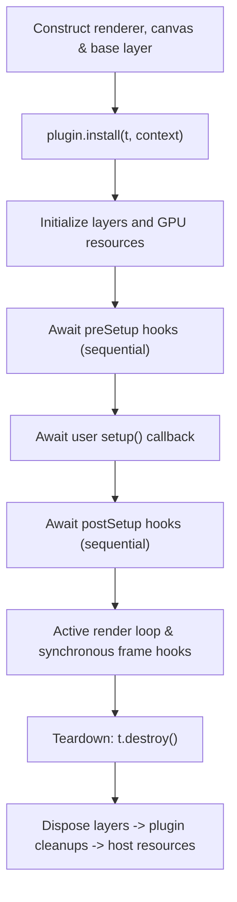
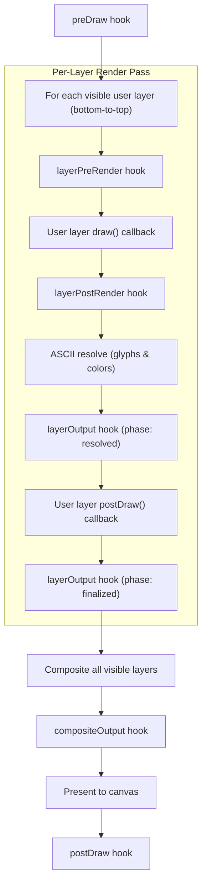

# Plugins

Plugins extend one [`Textmodifier`](/api/textmode.js/classes/Textmodifier) when it is created. Hook and extension
registrations belong to that installation and are removed when the instance is destroyed.

## Install a plugin

```js
import { textmode } from "textmode.js";
import { FiltersPlugin } from "textmode.filters.js";

const t = textmode.create({
  width: 800,
  height: 600,
  plugins: [FiltersPlugin],
});
```

`install()` is synchronous and returns an optional cleanup function. Extensions are therefore available as soon as
`textmode.create()` returns. Awaited initialization belongs in the `preSetup` or `postSetup` hook. The returned cleanup
releases the plugin's own resources and runs exactly once during rollback or teardown.

## Lifecycle



Each user frame runs in this order:



Setup hooks run sequentially in plugin installation order and may be asynchronous. Every draw, layer, and output hook
must finish synchronously. Returning a promise from one of those hooks raises an error immediately.

## Plugin context

The context has two facilities:

| Need | Method |
| --- | --- |
| Observe lifecycle or transform output | `context.on(name, callback)` |
| Add a method or accessor to one runtime instance | `context.defineExtension(target, name, descriptor)` |

### Register a hook

```ts
import type { TextmodePlugin } from "textmode.js";

export const MeterPlugin: TextmodePlugin = {
  name: "meter",

  install(t, context) {
    context.on("preSetup", async () => {
      await loadMeterData();
    });

    context.on("postDraw", () => {
      updateMeter(t.frameRate());
    });
  },
};
```

Available hook names are `preDraw`, `postDraw`, `layerCreated`, `layerDisposed`, `layerPreRender`, `layerPostRender`,
`preSetup`, `postSetup`, `layerOutput`, and `compositeOutput`.

### Define an instance extension

```ts
install(t, context) {
  context.defineExtension("textmodifier", "pulse", {
    value(amount: number) {
      applyPulse(t, amount);
    },
  });
}
```

Extensions are own properties of the targeted `Textmodifier`, layer manager, or layer. They do not mutate global
prototypes or other textmode instances. Name conflicts fail installation and all registrations made by that plugin are
rolled back.

### Transform output

```ts
install(t, context) {
  let shader;
  let output;

  context.on("preSetup", async () => {
    shader = await t.createShader(vertexSource, fragmentSource);
    output = t.createFramebuffer({ width: 1, height: 1, attachments: 1, depth: false });
  });

  context.on("layerOutput", ({ phase, output: input }) => {
    if (phase !== "resolved") return;
    output.resize(input.width, input.height);

    t.push();
    let begun = false;
    try {
      output.begin();
      begun = true;
      t.shader(shader);
      t.setUniforms({
        u_texture: input.textures[0],
        u_resolution: [output.width, output.height],
      });
      t.rect(output.width, output.height);
    } finally {
      try {
        if (begun) output.end();
      } finally {
        t.pop();
      }
    }
    return output;
  });
}
```

The shader's vertex source defines how the rectangle maps to clip space. `Textmodifier` owns both resources, while the
plugin controls their earlier replacement or disposal. Keep source and destination framebuffers distinct for texture
passes; `push()`/`pop()` and `begin()`/`end()` preserve drawing and framebuffer state after success or failure.

## Related interfaces

- [`TextmodeOptions.plugins`](/api/textmode.js/type-aliases/TextmodeOptions#plugins)
- [`plugins`](/api/textmode.js/namespaces/plugins/)
- [`TextmodePlugin`](/api/textmode.js/namespaces/plugins/interfaces/TextmodePlugin.md)
- [`TextmodePluginContext`](/api/textmode.js/namespaces/plugins/interfaces/TextmodePluginContext.md)
